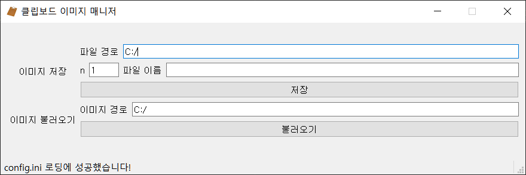

# 클립보드 이미지 매니저
Win+Shift+S. PrintScr 등으로 클립보드에 들어간 이미지를 간편하게 저장할 수 있게 해주는 프로그램입니다.

# 사용 방법
파일 경로: 클릭하면 클립보드에 저장된 이미지의 경로를 설정할 수 있습니다.  
파일 이름: 저장될 이미지의 이름을 입력합니다. {n} 을 입력하면 n 에 입력한 값이 자동으로 입력됩니다.  
n       : 파일의 숫자를 입력할 수 있습니다.  파일 이름을 설정하는 칸에 {n} 을 입력하면 n 에 입력된 값이 자동으로 들어갑니다.
   
### 자세한 설명은 프로그램 내부를 참조하시기 바랍니다.
# 스크린샷

# 버전 히스토리
| 버전 | 버전 이름 | 추가 사항 |
|-----|----------|----------|
| 0.1 | Initial Release | 기본적인 클립보드-파일 저장 기능과 파일-클립보드 불러오기 기능 구현 |

### 주의 사항
파이썬 **3.8** 버전, **윈도우 10** 환경에서 작성, 테스트되었습니다. 이외의 환경에서 오작동이 있거나 실행이 되지 않을 수 있습니다.  
